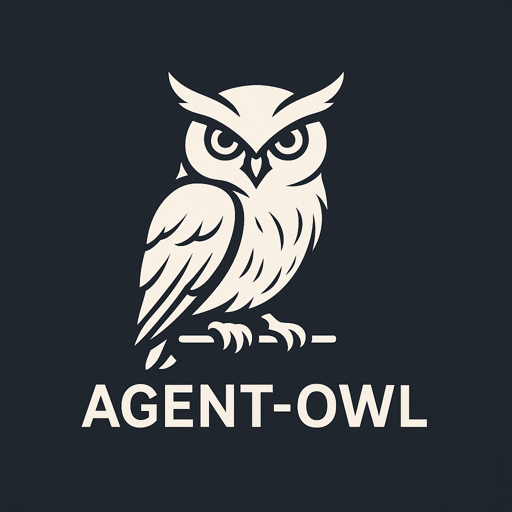

<div align="center">
  

  # 🦉 Agent Owl

  **Smart AI Agent Monitor** - Keep your AI agents working autonomously without interruption spam

  <p>Agent Owl watches your AI agents (like Codex, Aider, Claude Code, etc.) and intelligently detects when they're truly idle versus actively thinking. It uses screenshot comparison to avoid interrupting agents mid-thought and only sends continuation prompts when genuinely needed.</p>
</div>

---

## ✨ Features

- **🎯 Smart Idle Detection**: Uses screenshot comparison instead of timers to detect actual idleness
- **🔌 Pluggable Verification**: Custom plugins for verifying application state (Unity, servers, databases, etc.)
- **⏰ Configurable Cooldowns**: Prevent prompt spam with customizable cooldown periods
- **📸 Screenshot History**: Automatically saves screenshots for debugging and analysis
- **🎛️ Flexible Configuration**: JSON configs or command-line arguments
- **🐍 Pure Python**: Easy to extend and customize

---

## 🚀 Quick Start

### Installation

```bash
# Clone the repository
git clone https://github.com/yourusername/agent-owl.git
cd agent-owl

# Install dependencies
pip install -r requirements.txt
```

### Basic Usage

```bash
# Monitor a window with default settings
python agent_owl.py --window "PowerShell"

# Use a configuration file
python agent_owl.py --config configs/codex_unity.json

# Override specific settings
python agent_owl.py --window "Claude" --interval 60 --cooldown 20
```

---

## 📖 How It Works

1. **Screenshot Capture**: Takes screenshots of the target window at regular intervals
2. **Comparison Analysis**: Compares the last N screenshots pixel-by-pixel
3. **Idle Detection**: If all screenshots are identical, the agent is truly idle (not just thinking)
4. **Cooldown Check**: Ensures minimum time between prompts to avoid spam
5. **Custom Verification** (optional): Runs your plugin to check application state
6. **Smart Prompting**: Sends appropriate continuation message based on verification results

### Why Screenshot Comparison?

Traditional monitors use **timers** to detect idleness:
- ❌ Can't tell if agent is thinking or truly stuck
- ❌ Interrupts agents mid-task
- ❌ Creates prompt spam

Agent Owl uses **screenshot comparison**:
- ✅ Detects actual output changes
- ✅ Only prompts when truly frozen
- ✅ Respects agent thinking time (even if 15+ minutes!)

---

## ⚙️ Configuration

### Configuration File Format

```json
{
  "window_pattern": "PowerShell",
  "check_interval": 90,
  "screenshots_to_compare": 4,
  "cooldown_minutes": 20,
  "screenshot_threshold": 0.01,
  "screenshot_dir": "screenshots",

  "verification_plugin": "examples/unity_verification.py",

  "prompts": {
    "default": "Continue working on the task.",
    "unity_running": "Continue fixing the Unity project.",
    "unity_not_running": "Please start Unity and continue."
  }
}
```

### Configuration Options

| Option | Type | Default | Description |
|--------|------|---------|-------------|
| `window_pattern` | string | `"Agent"` | Window title pattern to match |
| `check_interval` | int | `90` | Seconds between screenshot checks |
| `screenshots_to_compare` | int | `4` | Number of identical screenshots needed for "idle" |
| `cooldown_minutes` | int | `15` | Minimum minutes between prompts |
| `screenshot_threshold` | float | `0.01` | Pixel difference threshold (0.01 = 1%) |
| `screenshot_dir` | string | `"screenshots"` | Directory to save screenshots |
| `verification_plugin` | string | `null` | Path to custom verification plugin |
| `prompts` | object | - | Custom prompts mapped to verification statuses |

---

## 🔌 Verification Plugins

Create custom verification plugins to check application state and tailor prompts.

### Plugin Structure

```python
def verify():
    """
    Verify application state

    Returns:
        tuple: (status, message, prompt_override)
    """
    # Your verification logic here

    if some_condition:
        return 'error_state', 'Description of issue', None

    return 'ok', 'Everything looks good', None
```

### Example: Unity Verification

```python
import psutil
import os

def verify():
    # Check if Unity is running
    unity_running = any('unity' in p.name().lower()
                       for p in psutil.process_iter())

    if not unity_running:
        return 'unity_not_running', 'Unity is not running', None

    # Check Unity logs for errors
    log_path = os.path.expanduser(r"~\AppData\Local\Unity\Editor\Editor.log")
    # ... parse logs ...

    return 'unity_running', 'Unity running normally', None
```

### Included Examples

- **`examples/unity_verification.py`**: Monitor Unity Editor state and logs
- **`examples/simple_verification.py`**: Template for custom plugins

---

## 📋 Use Cases

### 1. Monitoring Codex on Unity Development

```bash
python agent_owl.py --config configs/codex_unity.json
```

Keeps Codex working on Unity projects, checking for compilation errors and runtime issues.

### 2. Long-Running Code Generation Tasks

```bash
python agent_owl.py --window "Aider" --interval 120 --cooldown 30
```

Perfect for multi-hour refactoring tasks where the agent might pause between files.

### 3. Server Deployment Monitoring

Create a custom verification plugin to check deployment status and prompt the agent accordingly.

---

## 🛠️ Advanced Usage

### Command-Line Arguments

```bash
python agent_owl.py [OPTIONS]

Options:
  --config PATH        Path to JSON config file
  --window PATTERN     Window title pattern to match
  --interval SECONDS   Check interval (default: 90)
  --screenshots N      Screenshots to compare (default: 4)
  --cooldown MINUTES   Minutes between prompts (default: 15)
```

### Creating Custom Configs

1. Copy `configs/basic.json` to a new file
2. Modify settings for your use case
3. Optionally create a verification plugin
4. Run with `--config your_config.json`

### Adjusting Sensitivity

**Agent seems too responsive (interrupting work):**
- Increase `screenshots_to_compare` (e.g., 5-6)
- Increase `check_interval` (e.g., 120)
- Increase `cooldown_minutes` (e.g., 25-30)

**Agent misses idle states:**
- Decrease `screenshots_to_compare` (e.g., 2-3)
- Decrease `check_interval` (e.g., 60)
- Adjust `screenshot_threshold` (e.g., 0.02 for 2% difference)

---

## 📁 Project Structure

```
agent-owl/
├── agent_owl.py              # Main monitor script
├── requirements.txt          # Python dependencies
├── README.md                 # This file
├── LICENSE                   # License information
├── .gitignore               # Git ignore rules
├── configs/                 # Configuration files
│   ├── basic.json           # Basic config template
│   └── codex_unity.json     # Codex + Unity example
├── examples/                # Example verification plugins
│   ├── unity_verification.py
│   └── simple_verification.py
└── screenshots/             # Auto-generated screenshots (ignored by git)
```

---

## 🤝 Contributing

Contributions welcome! Here are some ways to help:

- 🐛 Report bugs and issues
- 💡 Suggest new features or verification plugins
- 📝 Improve documentation
- 🔌 Share your custom verification plugins
- ⭐ Star the repo if you find it useful!

---

## 📜 License

MIT License - see LICENSE file for details

---

## 🙏 Acknowledgments

Inspired by the need to keep AI agents productive on long-running tasks without manual babysitting or prompt spam.

---

## 📞 Support

- **Issues**: [GitHub Issues](https://github.com/yourusername/agent-owl/issues)
- **Discussions**: [GitHub Discussions](https://github.com/yourusername/agent-owl/discussions)

---

## 🎯 Roadmap

- [ ] OCR-based text change detection (alternative to pixel comparison)
- [ ] Web dashboard for monitoring multiple agents
- [ ] Slack/Discord notifications
- [ ] Pre-built verification plugins (Docker, Postgres, etc.)
- [ ] Cloud deployment support

---

**Happy Monitoring! 🦉**
